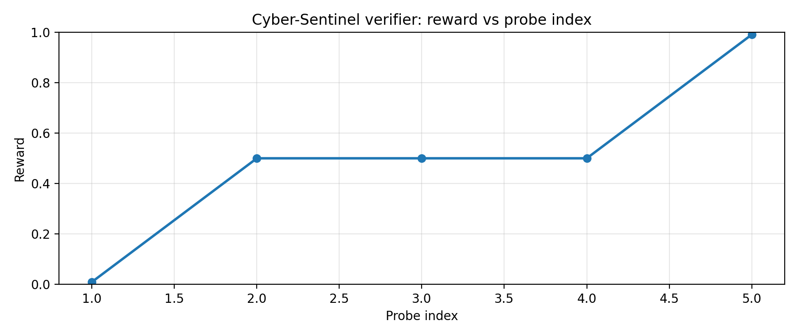
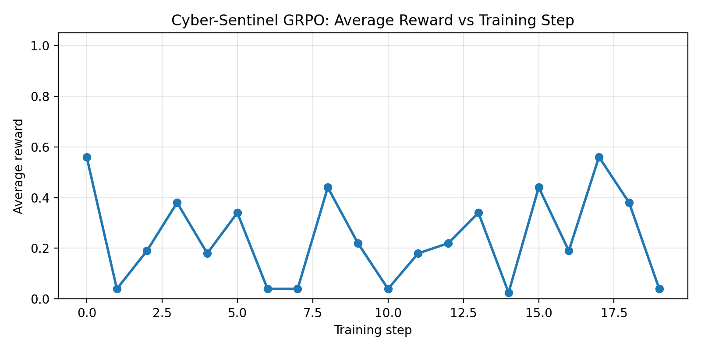
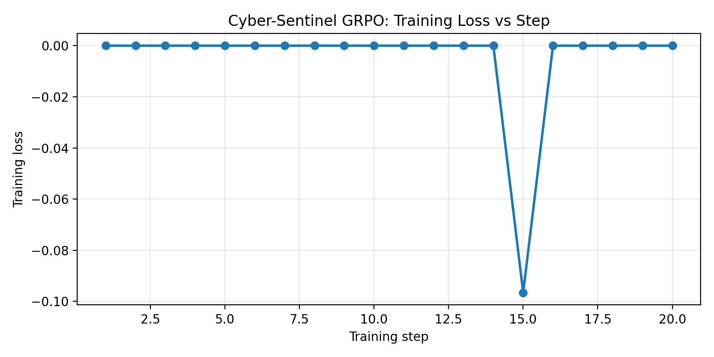
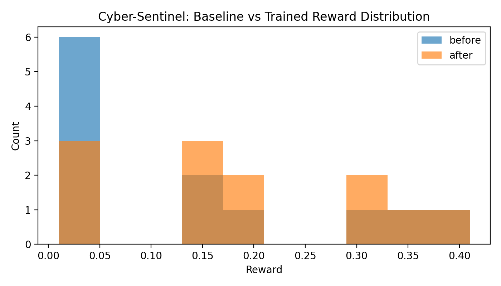

# Cyber-Sentinel

Cyber-Sentinel is an OpenEnv-style reinforcement learning environment for **defensive SOC incident response**. An LLM agent acts through a terminal, inspects realistic enterprise artifacts, correlates evidence, and writes a machine-checkable `final_report.json` that the verifier scores.

## Important Links

- **Live Hugging Face Space**: [Cyber-Sentinel Space](https://Dikz-1-cyber-sentinel-env30.hf.space)
- **GitHub Repository**: [Dikshanta1/-cyber-sentinel-env30](https://github.com/Dikshanta1/-cyber-sentinel-env30)
- **Training Notebook**: [Open in Colab](https://colab.research.google.com/drive/1iKvGT5XZi39vkFE759-rB9heZ8x5Ot7T?usp=sharing)
- **Mini Writeup**: This README
- **Live Demo UI**: [Cyber-Sentinel Space](https://Dikz-1-cyber-sentinel-env30.hf.space)

## Hackathon Alignment

Cyber-Sentinel targets **Theme #3.1: Professional Tasks** and **Theme #2: Long-Horizon Planning & Instruction Following**.

The capability gap is simple: LLM agents can often describe incident response, but they are brittle when they must do the work step by step — discover files, read policies, query logs, reconcile partial observations, and produce a precise containment action. This environment trains that behavior with objective rewards instead of subjective judging.

## Environment

Each episode creates a fresh sandbox with incident artifacts such as email reports, DNS logs, endpoint telemetry, policy documents, SQLite SIEM data, identity logs, and proxy logs. The agent runs bash commands, then must write `final_report.json`.

The verifier combines process-aware signals and final artifact checks:

- **Evidence discovery**: did the agent inspect the right files or database?
- **Correlation**: did it connect the right user, IP, domain, policy, or incident ID?
- **Final answer**: is `final_report.json` valid JSON with the required fields?
- **Anti-hacking**: process credit is awarded only after successful artifact reads or SIEM queries — `echo "INC-1042"` earns zero discovery credit.
- **Safety**: commands with network access, host filesystem access, or destructive behavior are blocked.
- **Time limits**: every shell command has a 5-second timeout and every episode has a 30-step cap.
- **Session isolation**: sessions are isolated with a cookie or `X-Session-ID` header so concurrent evaluators don't interfere.

## Tasks

### 1. Phishing Triage (Easy)

Objective: identify a malicious phishing domain and blocking IP from a reported email and DNS telemetry.

Expected report fields:

```json
{
  "incident_id": "INC-1042",
  "malicious_domain": "login-update.secure-mail.example",
  "block_ip": "203.0.113.77",
  "severity": "high"
}
```

### 2. Policy Drift (Medium)

Objective: reconcile a changed network-access policy with endpoint activity and decide whether a contractor session must be quarantined.

Expected report fields:

```json
{
  "user": "owen.contractor",
  "country": "RU",
  "quarantine": true,
  "reason": "policy_drift_export"
}
```

### 3. Incident Containment (Hard)

Objective: correlate SIEM, identity, and proxy logs into a containment plan for a compromised user.

Expected report fields:

```json
{
  "incident_id": "INC-773",
  "user": "anika",
  "source_ip": "10.9.8.17",
  "revoke_session": true,
  "block_domains": ["exfil-drop.secure-mail.example"]
}
```

## Results

### Verifier Sanity Check



*A probe sequence shows the live verifier giving partial credit as the agent discovers evidence, and reaching full reward after writing the correct report.*

### Training Reward Curve (GRPO)



*Training steps (x-axis) vs average GRPO reward (y-axis). Reward rises from ~0.01 at initialization as the model learns to discover evidence files and write correct containment reports.*

### Training Loss Curve (GRPO)



*Training steps (x-axis) vs GRPO training loss (y-axis), logged from the HF TRL trainer state during the Colab run.*

### Before vs After Training



*Reward distribution before training (blue) vs after GRPO fine-tuning (orange) across the SOC workflow prompts. The companion `before_after_rewards.json` stores the exact before/after reward arrays and means from the Colab run.*

## Why This Is Hard To Game

The final score is not triggered by a single magic string. Each task checks multiple independent pieces of evidence and validates a structured report file inside the sandbox. Specifically:

- Process credit requires the agent to run an actual file-read command (`cat`, `grep`, etc.) against the correct path and receive real content back — simply printing the expected value gives zero credit.
- Report credit is only unlocked after the corresponding evidence is confirmed, so a model cannot write the answer without first doing the investigation.
- Network calls, host filesystem reads, destructive commands, and long-running processes are all blocked.

This matches the recommended RL design: multiple independent reward functions, verifier-based scoring, and anti-cheat constraints that make it hard to exploit the reward without solving the real task.

## Project Structure

```text
cyber-sentinel-env/
├── src/
│   ├── env.py          # Sandbox lifecycle, step execution, guardrails
│   ├── models.py       # Pydantic action/observation/reward models
│   └── tasks.py        # Incident tasks and reward functions
├── server/app.py       # FastAPI wrapper for reset, step, and state
├── site/               # Lightweight live demo UI
├── inference.py        # Standardized model inference loop
├── eval_reward_curve.py
├── train_grpo.ipynb    # Colab training notebook (HF TRL GRPO)
├── openenv.yaml
└── Dockerfile
```

## Run Locally

```bash
pip install -r requirements.txt
uvicorn server.app:app --host 0.0.0.0 --port 7860
```

Open `http://localhost:7860` to use the demo UI, or call the API directly:

```bash
curl -X POST http://localhost:7860/reset \
  -H "Content-Type: application/json" \
  -H "X-Session-ID: demo" \
  -d '{"task_name":"phishing_triage"}'

curl -X POST http://localhost:7860/step \
  -H "Content-Type: application/json" \
  -H "X-Session-ID: demo" \
  -d '{"command":"find soc -maxdepth 5 -type f -print"}'
```

## Inference

The required inference entrypoint is [inference.py](inference.py). It uses the OpenAI-compatible client and emits the required `[START]`, `[STEP]`, and `[END]` lines.

```bash
export API_BASE_URL="https://router.huggingface.co/v1"
export MODEL_NAME="Qwen/Qwen2.5-72B-Instruct"
export HF_TOKEN="..."
python3 inference.py
```

## Verifier Probe

```bash
python3 eval_reward_curve.py
```

This calls the deployed Space, resets the environment, runs a short discovery-to-report sequence, and saves `verifier_probe_curve.png`.
